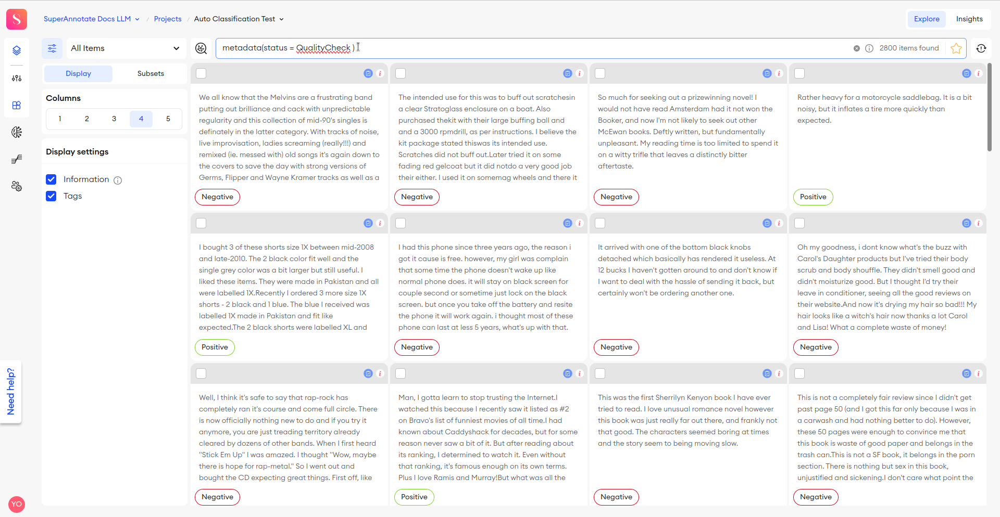

# Tutorial: Setting Up Pipeline #

> NOTE:\
> By default, there is a strict limit on the minimum amount of labeled data for each class. Auto Classification will not commence until **100** items are labeled for each class in your project. You can modify these conditions by accessing the Action menu and adjusting the `COUNT_ITEMS_PER_CLASS` constant. \
**WARNING**: Setting values below this threshold may compromise the training quality, and it is unlikely to be adequate for classical algorithms.

## WARNING ##

Please pay attention to the logic of the service. At the moment when the train&predict Action is launched. In turn, the prediction part predicts all items that are not annotated as Completed and uploads its predictions to the platform in such a way that it overwrites the previous annotation. That is, if you still have samples with annotation, but the status is different from Completed, or you added something after the algorithm started, this data will be overwritten.

One option to avoid this is to put the data that you do not want to predict into a separate folder and NOT include it in the service configuration file.

## Introduction ##

In this tutorial, we'll guide you through setting up Auto-Classification pipeline for a text project on the SuperAnnotate platform. This pipeline automates the process by triggering actions based on predefined conditions, such as reaching a certain number of annotated samples per class. When triggered, the pipeline sends a request to the deployed Text Auto Classification service. Subsequently, the service downloads data from the SuperAnnotate platform, utilizes labeled data for model training, predicts classes for remaining data, and uploads these predictions back to the platform. Additionally, checkpoints of the trained model are saved on an S3 bucket for future reference.

## Pre-requirements ##

Before you begin, make sure you meet the following prerequisites:

1. **SuperAnnotate Account:** SuperAnnotate Account: You'll need to have set up a text project on the SuperAnnotate platform. If you haven't already, follow the instructions [here](https://doc.superannotate.com/docs/create-a-project) to set up a project. \
   ***NOTE***: Please ensure that the file structure on the SuperAnnotate platform matches that in your integration (usually an S3 bucket).

2. **API Service Configuration:** Make sure you have configured and launched the API service according to the instructions provided in the [**Readme**](README.md).
   ***NOTES***:
      - To verify that everything is functioning correctly, try calling the healthcheck endpoint.
      - Also, ensure that the port on which your service is deployed (8080 by default) is open to the global network. Refer to this [**tutorial**](https://stackoverflow.com/questions/5004159/opening-port-80-ec2-amazon-web-services/10454688#10454688) for guidance on opening a port on an EC2 instance.

## Pipeline creation ##

1. **Navigate to Orchestrate Tab:**
   - Open the main page of your team.
   - In the left column, find the `Orchestrate` tab and click on it.

   

2. **Create a New Action:**
   - Go to the `Action` tab at the top and click on it.
   - Create a new action.

   

3. **Choose Action Type:**
   - Select "New Action."

   

4. **Configure Action Settings:**
   - Give your action a name (e.g., Call train&predict by condition).
   - Add the necessary code located in the repository at the specified path `etc/action_code.py`.
   - Add dependencies to the Environment window by pasting:

      ```
      requests~=2.31.0
      superannotate==4.4.19
      ```

   

5. **Save Action:**
   - Click the save button in the upper right corner.
   - Wait until your action's build status changes to `Ready`.

   

6. **Create Secrets for Action:**
   - Go to the `Secrets` tab at the left swithcer and click on it
   - Create new secret, by pressing `New Secret` button accordingly
   - Give it name and fill 2 reqired keys:
      - `SA_TOKEN` your SuperAnnotate token. You can read more [here](https://doc.superannotate.com/docs/python-sdk#with-arguments)
      - `URL` Your URL address (host:port) of deployed service. Port by default will be an 8080

   

7. **Return to Pipelines Page:**
   - Go back to the pipelines page using the tabs in the upper right corner.
   - Create a new pipeline.

   

8. **Add Blocks to Workspace:**
   - Move the `Folder status updated` and your custom action blocks to the workspace.
   - They can be found at the following paths:
      - `Events` -> `Folder` -> `Folder status updated`
      - `Actions` -> `Custom actions` -> `<Your action name>`

   

9. **Configure Blocks:**
   - Select the `Folder status updated` block.
   - Fill in the required fields like this.
      - **From**: Any value
      - **To**: Completed
      - Check the box for "Specific projects" and select your text project.
      - Optionally specify folders from which data will launch the pipeline.
   - Select your custom action block and attach your secret created at the 6 step.
   - Connect the two blocks (`Event` -> `Action`).

   

10. **Save Pipeline:**
   - Save your pipeline.
   - Everything is ready for using!

   

## How to run and check pipeline works ##

The logic of the pipeline we've created operates as follows: whenever some folder is set in your event in step 9 its status to Completed, our `Action` code is triggered. The Action checks a condition - whether we have at least 100 samples for each class. If not, the training does not start, and we're notified that there isn't enough data. If the condition is met, the action launches the web service deployed, initiating the training and prediction process. The action monitors the process and notifies us about the current status of the task.

Let's try it with an example:

1. **Marking Samples:**
   - Mark 100 samples in the test project. For example, in a sentiment text analysis project with binary classification (Positive and Negative), mark 40 positive samples and 60 negative samples.
   - And change folder status to `Completed`

   

2. **Viewing Pipeline Results:**
   - Go to the `Orchestrate` tab and open the `Monitoring` for the pipeline we created.

   

3. **Reviewing Event Logs:**
   - You can see 1 completed event here to understand what happened, expand it, and then expand our custom action and choose `Logs` tab to view its Logs
   - Here you will see that your service didn't start because there wasn't enough annotated data.

   

4. **Adding Additional Data:**
   - Return to project page and change folder status to any value except `Completed`.
   - Add 60 more positive items and 40 negative ones to reach the required number of marked items (100 samples per class).
   - Change folder status to `Completed`
   - Return to the `Monitoring` tab, and you'll see the last event received the status Pending.
   - Open the event and navigate to the action logs to observe the process status appearing every minute until the training and prediction are completed.

   

5. **Check the result:**
   - After your event status is completed
   - You can find the saved checkpoints of the model on the S3 bucket, respectively specified in the config (`service_config.json` -> `AWS_URL_TO_MODEL_UPLOAD`)
   - And also all other items, in the designated folders, that didn't have a completed status will be automatically annotated and will have on a new status `QualityCheck`

   

## Advises and bottlenecks ##

Here are some tips and considerations for customizing and optimizing your pipeline:

- **Top-Level Configuration:**
  - Customize the service configuration files according to the documentation in the project's [**Readme**](README.md). This allows you to adjust training hyperparameters and experiment with different configurations to improve model quality.

- **Hyperparameter Tuning:**
  - If you're unsatisfied with the quality of the trained model, consider tweaking training hyperparameters. These are initially set with default values but may not be optimal for all cases. You can also try using a larger pre-trained BERT-like model from the [HuggingFace hub](https://huggingface.co/models), but be prepared for increased GPU resource requirements or adjust the batch size accordingly.

- **Customization of Training Details:**
  - If you need to modify data preprocessing or other teaching details, be prepared to directly modify the relevant parts of the code in the service. Fortunately, the code is well-documented and flexible, allowing for adaptation and customization.

- **Training Data Considerations:**
  - While the tutorial sets the starting conditions for training at 100 samples per class, this may not always be sufficient for training a high-quality model. In complex tasks where classes are difficult to separate, consider increasing this limit up to 500 samples per class for more stable results. Remember, more data generally leads to more robust models.

## Conclusion ##

In this tutorial, we've walked through the process of setting up an auto-classification pipeline for a text project on the SuperAnnotate platform. By following the steps outlined, you've learned how to create and configure actions, define conditions for triggering the pipeline, and monitor its progress.

Key takeaways from this tutorial include:

- Understanding the logic behind the pipeline and how it automates tasks based on predefined conditions.
- Configuring actions and pipelines within the SuperAnnotate platform to streamline your workflow.
- Monitoring the pipeline's progress and troubleshooting any issues that may arise.

As you continue to explore and utilize the capabilities of SuperAnnotate, we encourage you to delve deeper into its features and functionalities. Don't hesitate to seek help from the SuperAnnotate documentation, or support team if you encounter any challenges or have questions.

Thank you for completing this tutorial, and we hope it has equipped you with the knowledge and skills to leverage auto-classification pipelines effectively in your projects.
